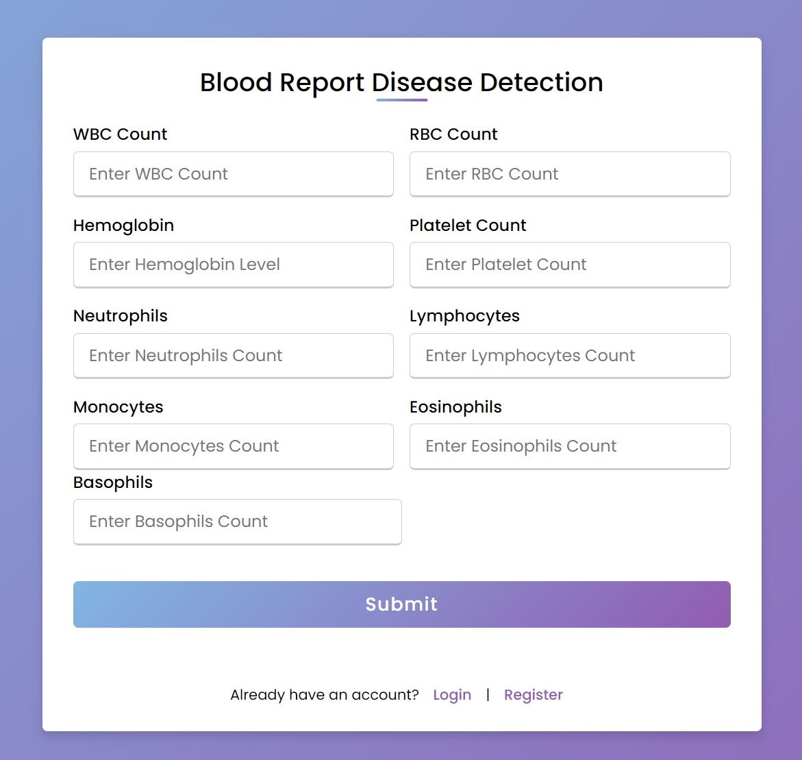

# Blood Report Disease Diagnosis with Machine Learning

This project is a Flask web application that uses a machine learning model to predict various blood disorders based on user-provided blood test results. The application uses a **Random Forest Classifier** to analyze blood parameters such as WBC count, RBC count, Hemoglobin levels, and more to predict potential blood disorders like Anemia, Leukocytosis, Thrombocytopenia, and others.

    

## 🔗 Live Demo

👉 [Try the App Here](https://blood-disease-detection.onrender.com/)

## Features
- Predicts blood disorders based on user inputs of blood parameters.
- Provides reasons or potential causes for each prediction.
- Allows users to register, log in, and save prediction history.
- Displays a history of past predictions for logged-in users.

### Example Input:
- WBC: 5.0
- RBC: 4.7
- Hemoglobin: 13.0
- Platelets: 200
- Neutrophils: 60
- Lymphocytes: 30
- Monocytes: 4
- Eosinophils: 2
- Basophils: 0.5

### Example Output:
- **Predicted Disorder**: Anemia
- **Possible Causes**:
    - Anemia due to blood loss
    - Bone marrow disorders
    - Nutritional deficiency
    - Chronic kidney disease

## Technologies Used

- **Python**: Core programming language for backend and machine learning.
- **Flask**: Web framework for handling HTTP requests and routing.
- **scikit-learn**: Used for the Random Forest Classifier model.
- **Pandas and NumPy**: For data manipulation and handling.
- **SQLite**: Database for storing user information and history.
